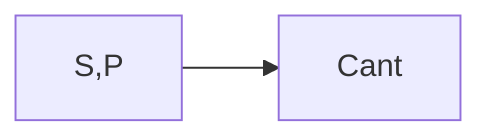

**Ventajas**
- Evita anomalias de actualizacion
- Mejora la independencia de los datos, permitiendo realizar extensiones a la BD

![[Pasted image 20231026203414.webp]]

<u>nuped</u>: número del pedido.  (es unico se tomara como llave de momento)
**fecha**: fecha en que se realiza el pedido.
**nuprov**: número del proveedor.
**noprov**: nombre del proveedor.
**direc**: dirección del proveedor.
**nuprod**: número del producto.
**desc**: descripción del producto.
**prun**: precio unitario del producto.
**cant**: cantidad de unidades del producto que se solicita.
**prprod**: precio a pagar por concepto de ese producto; se corresponde con la columna TOTAL.
**prped**: precio a pagar por todo el pedido; se corresponde con el IMPORTE TOTAL

PEDIDO (<u>nuped</u>, fecha, nuprov, noprov, direc, nuprod, desc, prun, cant, prprod, prped)

## (`1FN`) non-repetitive - atomics

- [ ] los atributos son atomicos
- [ ] no incluye nungun grupo repetitivo (ej productos)
- [ ] incluir la llave primaria

Se puede observar que la relación PEDIDO contiene cinco grupos repetitivos: **nuprod, desc, prun, cant, prprod**, ya que un pedido puede contener más de una línea de pedido

> [!Faq] problema entrada: Tendria que tener un tamaño limite
> Se puede observar que la relación PEDIDO contiene cinco grupos repetitivos: **nuprod, desc, prun, cant, prprod**, ya que un pedido puede contener más de una línea de pedido y, por 10 tanto, puede contener varios números de producto (nuprod), varias descripciones de producto (desc), varios precios unitarios (prun , varias cantidades (cant) y varios precios por concepto del producto (prprod).

> [!Info] Solucion
> 1. Se deja en la relacion original solo los atributos no repetidos
> 2. Una nueva relacion para los atributos repetidos, con llave primaria la de la relacion original
>    
> ![[1fn.svg]]
%%[[1fn.excalidraw|🖋 Edit in Excalidraw]], and the [[1fn.dark.svg|dark exported image]]%%
>  
> Ambas tienen como llave, o parte de la llave, a `nuped`. Pero en PED-PROD es necesario la llave compuesta para identificar los productos individuales

## (`DF`) Dependencia Funcional 

y depende de x
$$x \to y$$

> [!Info] DF Completa
> 🎯 cuando `Y` es dependiente de `X` y no de un subconjunto de `X`
> (ej cant es completamente dependiente de (s,p) pero no de s o p solos)

> [!Info] DF Transitiva
> ![[dependencia_transitiva.excalidraw.svg]]
%%[[dependencia_transitiva.excalidraw.excalidraw|🖋 Edit in Excalidraw]], and the [[dependencia_transitiva.excalidraw.dark.svg|dark exported image]]%%

## Llave, hallar llaves candidatas

> [!Faq] 🙅‍♂️ NO DEBE EXISTIR MAS LLAVES QUE DF

> [!Info] Llave
> $$R(a1, a2, ..., an)$$
> $$x \to \{a1, a2, ..., an\}$$
> 
> `X` es la llave de R si y solo si todos los atributos de `R` dependen funcionalmente de `X`
> 
> (`X` tiene que ser *MINIMA*)

### Como hallar las llaves candidatas

$$R(\text{ciudad}, \text{calle}, \text{codigo postal})$$
$$R(c, a, p)$$
- Una calle en una ciudad tiene un código postal: $ca \to p$
- EI código postal tiene una estructura tal que su valor determina la ciudad: $p \to c$ 
- Pero en una ciudad, varias calles pueden tener el mismo código, por lo que 🚫 se cumple $p \to a$.

1. $ca \to p$ pero $ca$ se determina a si mismo $ca \to ca$ entonces $$ca \to cap$$
	$ca$ determina a todos los atributos de $R$, y a su vez no existe ningun subconjunto de $ca$ que logre lo mismo

2. $p \to c$ pero agregando $a$ en el lado izq queda $$pa \to cap$$
	$pa$ determina a todos los atributos de $R$, y a su vez no existe ningun subconjunto de $ca$ que logre lo mismo

$(c,a,p)$ son atributos llave en este caso

## (`2FN`) total-functionality

- [ ] estar en **1FN**
- [ ] la DF de los atributos no llave respecto a la llave primaria tiene que ser **TOTAL**

> [!Faq]- Una relación que esté en **1FN** y que tenga una llave primaria simple, está en **2FN**.
> Este paso solo se aplica a las relaciones con **llaves compuestas**, pues no es posible que en una relación cuya llave primana sea simple haya atributos que dependan de parte de la llave primaria. 

> [!Info] Pasos si no se cumple el requisito de dependencia TOTAL
> 1. Se crea una nueva tabla para todos los atributos que dependen **TOTAL** mente de la llave
> 2. Una nueva relacion para los atributos que dependan de cada **subconjunto** de la llave
> 
> ![[2fn.svg]]
%%[[2fn.excalidraw|🖋 Edit in Excalidraw]], and the [[2fn.dark.svg|dark exported image]]%% 

## (`3FN`) non-transitivity

- [ ] estar en **2FN**
- [ ] no existir **Dependencias Transitivas**

Examinar todas las relaciones para ver si hay **atributos no llaves que dependan unos de otros**. Si se encuentran, se forma una nueva relación para ellos.

> [!Info] Pasos
> 1. nueva relacion con atributos **no llaves** que no dependen transitivamente de la **llave primaria**
> 2. nueva relacion con atributos **no llaves** que dependen transitivamente de la **llave primaria** a travez de otros atributos no llave primaria ese atributo intermediario seria la nueva **llave primaria**
> 
>  ![[3fn.excalidraw.svg]]
%%[[3fn.excalidraw.excalidraw|🖋 Edit in Excalidraw]], and the [[3fn.excalidraw.dark.svg|dark exported image]]%%
> 
> 3. eliminar relaciones **degeneradas** (contienen solo la llave y la info ya esta en otra relacion)
> 4. puede que varias relaciones tengan la misma clave, por lo que pueden combiar en una sola  

## Ejemplos

Pasos a dar para la aplicación de la normalización
1. Determinar las DF presentes en el fenómeno.
2. Representar en una única relación todos los atributos que participan, y son significativos, en el fenómeno.
3. Determinar las llaves candidatas y seleccionar la llave primaria. Indicar la llave primaria (subrayándola) en la relación que representa el fenómeno. (Al haber escogido bien la llave, se parte de una relación que está en IFN).
4. Aplicar la 2FN.
5. Aplicar la 3FN.
6. Aplicar la FNBC.
7. Analizar las relaciones obtenidas para optimizarlas (unir las que tenga sentido unir; eliminar las que no aporten información).

