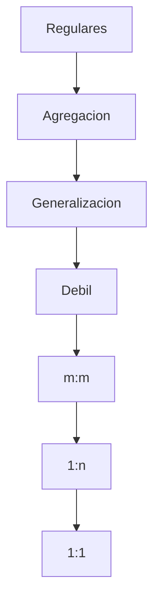

Tiene tres partes fundamentales: 
- Estructura de los datos (términos) 
- La integridad de los datos 
- La manipulación de los datos

![[Pasted image 20231015180331.webp]]

se denota $R(A_1, A_2, ..., A_n)$

`Dominio`: conjunto de valores válidos. Conjunto de valores atómicos cuyo nombre ayuda a interpretar sus valores. (tipo de datos)

Num_telef: Conjunto de números telefónicos de 10 dígitos válidos en Cuba. (ddd)ddd-dddd donde d es un dígito decimal. 
Num_CI: Conjunto de números de 11 dígitos aammddxxxxx.

`BD`: una colección de relaciones. 
`Relación`: una tabla. 
`Tupla`: fila o registro 
`Atributo`: columnas o campo 
`Grado`: número de columnas
`Cardinalidad`: número de tuplas ($|D|$, $card(D)$)

> [!Info]- 🗝️🗝️🗝️ Superclave
> Un superconjunto de una clave candidata
> 
> Una superclave NO es necesariamente **mínima**, lo que significa que puede contener atributos adicionales que no son necesarios para la identificación única.

> [!Info]- 🗝️🗝️ **Clave Candidata** (**mínima súper llave** de esa relación)s1 --> s2

> Porque se usa? 
> Hay situaciones en las que un solo atributo no es suficiente para garantizar la unicidad. Por ejemplo, considera una tabla que registra los vuelos de una aerolínea. En este caso, el número de vuelo por sí solo no sería suficiente para identificar de manera única cada vuelo, ya que un mismo número de vuelo puede ser utilizado para diferentes fechas y horas.
> 
> **Unicidad**: No pueden existir dos tuplas distintas en la relación con los mismos valores para los atributos que forman la llave candidata. En otras palabras, cada combinación de valores en la llave debe ser única.
> 
> **Irreductibilidad**: No se puede eliminar ningún atributo de la llave candidata sin perder la propiedad de unicidad. Es decir, no hay un subconjunto propio de los atributos de la llave que también cumpla con la condición de unicidad.
> 
> La irreductibilidad es una propiedad importante porque nos asegura que estamos utilizando el mínimo número de atributos necesario para identificar de manera única cada tupla en una relación.
> 
> - **Atributo primo** atributo que es miembro de cualquier clave de R
> - **Atributo no primo**: atributo que no es miembro de ninguna clave candidata

> [!Info]- 🔑 Clave Primaria
> La clave candidata seleccionada
> *El resto son alternas*

> [!Info]- 🗝️Clave Extranjera
> Llave que hace referencia a la llave primaria de otra relacion

> [!Info]- Ejemplo: Un ejemplo de llave candidata y superllave sería el siguiente:
> Supongamos que tenemos una relación Estudiante (CI, nombre, apellido, carrera, edad). Una llave candidata sería CI, ya que identifica de manera única a cada estudiante y no se puede reducir a un subconjunto de atributos. Otra llave candidata sería (nombre, apellido), ya que también identifica de manera única a cada estudiante y no se puede reducir a un subconjunto de atributos.
> 
> Una superllave sería cualquier conjunto de atributos que contenga a una llave candidata. Por ejemplo, (CI, carrera), (nombre, apellido, edad), (CI, nombre, apellido, carrera, edad) son superllaves. Sin embargo, no todas las superllaves son llaves candidatas, ya que algunas pueden reducirse a un subconjunto de atributos que también identifique de manera única a cada estudiante. Por ejemplo, (CI, carrera) se puede reducir a CI, que es una llave candidata.

![[Pasted image 20231015184458.webp]]

**Valor nulo**: Valor desconocido, indefinido o no inicializado

## Restricciones

- **Restricción de Dominio**: 
	cada atributo A tiene un valor atómico de su dominio. 
- **Restricción de llave**: 
	NO pueden tomar valores repetidos en dos tuplas o más. 
- **Restricción de integridad de entidad**: 
	la llave primaria NO puede ser nula. 
- **Restricción de Integridad referencial**: 
	una tupla en una relación R1 que haga referencia a otra relación R2 deberá referirse a una tupla existente en R2.

## Pautas

- No combinar atributos de varios tipos de entidades y vínculos en una sola relación. 
- Evitar valores nulos en los atributos de las tuplas. 
- Garantizar que no se formen tuplas erróneas en los JOIN entre relaciones. 
- Evitar anomalías de inserción, eliminación y modificación de las relaciones.

## Ejemplo

![[transformacion_entidades.excalidraw.svg]]

Orden 

1. Regulares
2. Agregacion
	- cada entidad agregada con sus atributos
	- el `id` si fue definido
	- las llaves de las entidades que forman la agregacion
	- (la primaria seria el id o de no existir las llaves de las que la forman)
3. Generalizada
	- se representan como simples pero la llave primaria sera la de la generalizacion
4. Debil
	- la debil tendra como primaria su llave y la de la fuerte
5. m:m
	- nueva tabla que tiene como llave primaria la de las que la for man
6. 1: m
	- se anade la llave de la del extremo 1 a la del extremo m como un simple atributo 
7. 1:1
	- anade la llave de cualquiera en el otro como simple atributo y los atributos de la relacion si los tuviera

> [!Info]- Ejemplo p116
> 
> ![[Pasted image 20231017183844.webp]]
> 
> ![[Pasted image 20231017183911.webp]]
> ![[Pasted image 20231017183941.webp]]
> ![[Pasted image 20231017183953.webp]]

